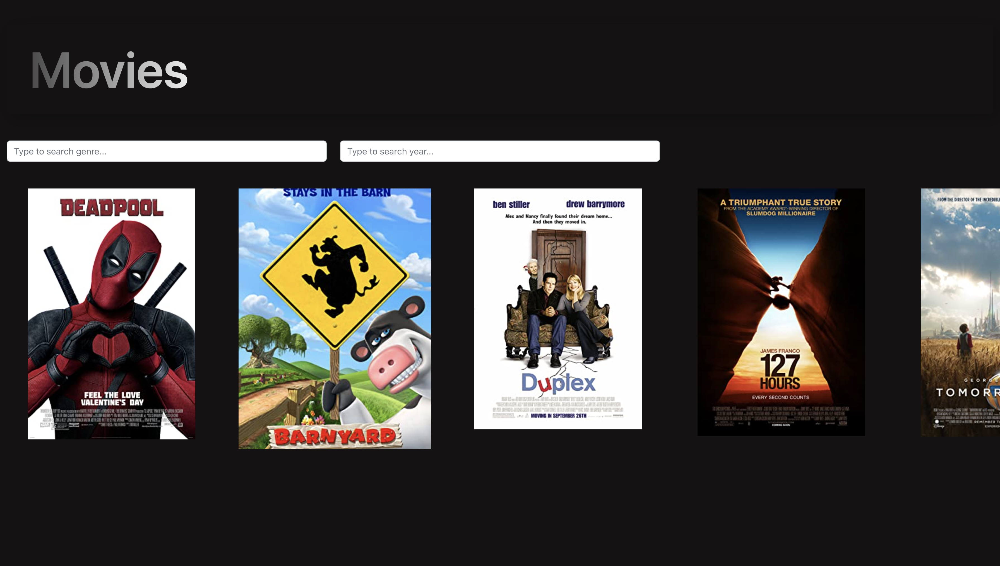

# movie-app
Challenge details: https://bluejay.notion.site/Frontend-Movie-630bd50954ff43a3a429636833790e5b

# Instructions to run locally
1. `git clone git@github.com:candyhy/movie-app.git`
2. `cd movie-app`
3. Ensure npm is installed through `npm -v`. Otherwise check out: https://radixweb.com/blog/installing-npm-and-nodejs-on-windows-and-mac#mac for details to install npm
4. In movie-app directory, `npm install` to install packages
5. Run app by `npm start` and view the app locally at http://localhost:3000/ in chrome browser

# Deployed App
- Accessible via `https://movie-app-navy-nu.vercel.app/`
- API is sometimes unstable, if an undefined poster image is shown, please refresh by reloading webpage or clicking the movies bar at the top
- UI should look like 

# Limitations
- Short assignment - Minimal Viable Product due to time constraint. I aimed to finish the project with blocks of free time over the course of 2 days.
- Error handling, design could be done better.
- API instability, I retrieved textual data from API provided and omdb API for posters and combined the data.

# API collection
- For postman imports: MoviesAPI.postman_collection.json

# NEW Changes
- Use of linters: eslint, prettier for better formatting
- Add error view to replace 'undefined' image when API fails
- Add loading view 
- Reformat movies into chunks of 4 per row with vertical scroll to account for greater scale of movies
- Add social media share buttons in movie description page to faciliate information sharing
